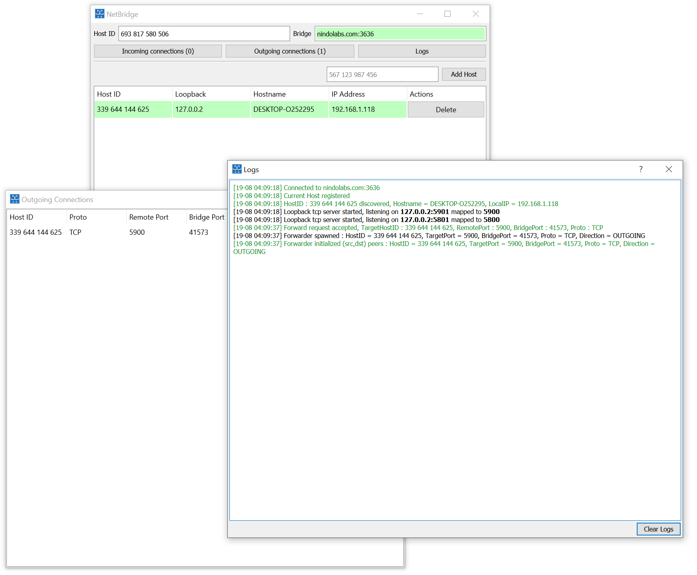
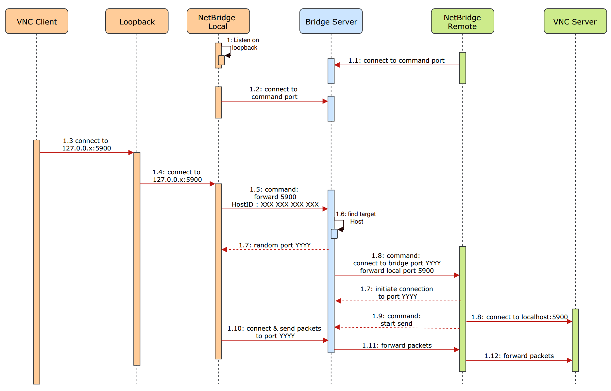

# NetBridge

## Description:
Light solution to bypass Firewalls/Nat...
## How to:
**Basic usage**:
- Run NetbridgeClient on your remote machine
- Edit your local machine's config.ini file to add the target ports (e.g : tcp_ports=5555 6565) if the ports are already used you can map them (e.g : tcp_ports_map=5555->1234 66565->9875)
- Run NetbridgeClient on your local machine
- Add your remote machine's HostID 
- Now you can use the allocated Loopback IP as the remote machine IP

**Advanced usage**:
- To change the loopback range edit loopback/begin= & loopback/end= in the ini file, avoid 127.0.0.0
- If the remote NetBridgeClient have troubles to forward packets to some local service (e.g vnc) turn udp/tcp_bypass_loopback to true
- You can customize the internal read & recv buffers by setting packet/read_some_size=...Bytes
- Requirements to build the server for other platforms : g++6.4 | cmake 3.10.3 
- Requirements to build the client for other platforms : g++6.4 | cmake 3.10.3 | Boost 1.61.0 | QT 5.11

## How it works:

Simplified SD:

